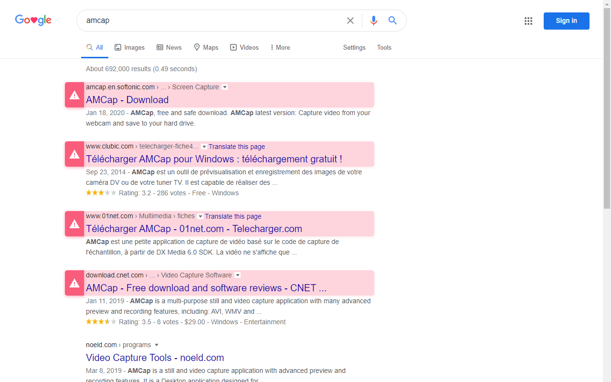

<h1 align="center">  GoogleSuspiciousHighlighter </h1>

A Chrome extension to Highlighter suspicious websites in Google search

## Preview:

## Downloads:

Go to the [**releases** tab](https://github.com/Loxoz/GoogleSuspiciousHighlighter/releases)

## Install:

Since this extension is not an official chrome extension, you're gonna have to install it as an **"unpacked extension"**, to do so, extract the downloaded archive to a folder, then go to `chrome://extensions`, toggle **developer mode** in the top right corner, and click on **Load unpacked extension** in the top left corner, then you should now see the extension in the list below. (**warning:** loading unpacked extension causes chrome to show a popup at each start warning you that you have one loaded)

## Building:

Because this extension uses sass, to build any changes added to the [inject.scss](inject.scss) file, you're going to need [sass](https://sass-lang.com/), which can be installed using `npm i -g sass` then doing `sass style.scss style.css --no-source-map` to build (or even `sass style.scss style.css --no-source-map --watch` to watch for changes and rebuild directly) the [inject.css](inject.css).
